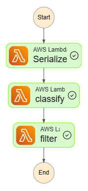
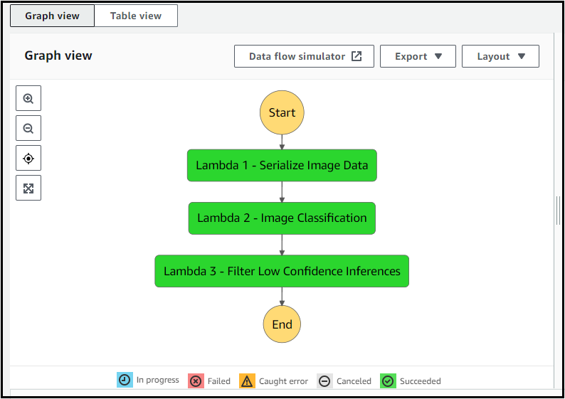

# End-to-End ML Workflow for Scones Unlimited on AWS SageMaker

### Project for the AWS Machine Learning Fundamentals Nanodegree by Udacity

This project demonstrates the development and deployment of a complete, event-driven machine learning workflow on AWS. The goal was to build an image classification solution for "Scones Unlimited," a fictional logistics company, to automatically distinguish between **bicycles** and **motorcycles**. This allows the company to optimize delivery assignments and better manage its fleet.

The entire pipeline—from data processing to model training, deployment, and serverless inference—is built using powerful AWS services, showcasing a scalable and automated MLOps approach.

## Dataset

The model was trained on a subset of the [CIFAR-100 Dataset](https://www.cs.toronto.edu/~kriz/cifar-100-python.tar.gz), provided by the University of Toronto.

## Machine Learning Workflow Architecture

The core of this project is a serverless workflow orchestrated by **AWS Step Functions**. This state machine defines the flow of data through a series of AWS Lambda functions, which process the data, invoke a SageMaker endpoint for inference, and filter the results based on a confidence threshold.

---

## Project Components

### 1. Data Staging and Preparation (ETL)

- **Extract:** The raw CIFAR-100 dataset was downloaded and extracted within the SageMaker environment.
- **Transform:** The dataset was filtered to isolate only two classes: `bicycle` and `motorcycle`. The raw image data was reshaped from a flat array into a 3D (32x32x3) image format and saved as PNG files.
- **Load:** The processed training and testing images, along with manifest `.lst` files, were uploaded to an **Amazon S3** bucket to be used as a data source for model training.

### 2. Model Training and Deployment

- **Algorithm:** The project leverages the built-in **SageMaker Image Classification Algorithm**, which uses a ResNet deep learning architecture.
- **Training:** A SageMaker `Estimator` was configured to launch a training job on a `ml.p3.2xlarge` instance, training the model on the 1000 prepared images from S3.
- **Deployment:** The trained model was deployed to a persistent **SageMaker Endpoint** on a `ml.m5.xlarge` instance, making it available for real-time inference.

### 3. Serverless Inference Pipeline

The inference pipeline is orchestrated by **AWS Step Functions** and powered by three distinct **AWS Lambda** functions:

1.  **`serializeImageData`**: Receives an S3 object key, downloads the image, and base64-encodes it.
2.  **`classifyImage`**: Takes the encoded image, invokes the SageMaker endpoint to get a prediction, and adds the inference results to the data payload.
3.  **`filterLowConfidence`**: Parses the inference results and checks if the confidence score is above a predefined threshold (e.g., 70%). If not, it "fails loudly" by raising an exception, which stops the workflow.

### 4. Monitoring and Visualization

- **SageMaker Model Monitor** was enabled on the endpoint to capture 100% of the inference requests and responses.
- This captured data was downloaded from S3, parsed, and used to create a visualization of the model's performance over time.

---

## Project Files

- **`starter.ipynb`** - Main Jupyter notebook containing the complete implementation
- **`lambda.py`** - Lambda function code for the Step Functions workflow
- **`stepfunctions_graph.png`** - Visual representation of the workflow architecture
- **`Screenshot-of-Working-Step-Function.PNG`** - Demonstration of successful workflow execution

---

## Project Showcase

### Successful Step Function Execution

This screenshot shows a successful run where the inference confidence was above the threshold, allowing all three steps to complete.

### Key Achievements

- **Model Performance**: Successfully classified bicycle vs motorcycle images with high accuracy
- **Serverless Architecture**: Implemented fully serverless ML inference pipeline using AWS Lambda and Step Functions
- **Error Handling**: Built robust error handling with confidence threshold filtering
- **Monitoring**: Enabled comprehensive monitoring with SageMaker Model Monitor
- **Scalability**: Created a scalable solution that can handle varying inference loads

---

## Technologies Used

- **AWS SageMaker**: Model training, deployment, and monitoring
- **AWS Step Functions**: Workflow orchestration and state management
- **AWS Lambda**: Serverless compute for data processing and inference
- **Amazon S3**: Data storage and model artifacts
- **Python**: Primary programming language
- **CIFAR-100 Dataset**: Training data source
- **ResNet**: Deep learning architecture for image classification

---

## Setup and Usage

### Prerequisites

- AWS Account with appropriate permissions
- SageMaker Studio or Notebook Instance
- S3 bucket for data storage

### Installation Steps

1. Clone this repository into your SageMaker environment
2. Open the `starter.ipynb` notebook
3. Follow the step-by-step instructions in the notebook
4. Configure your AWS credentials and S3 bucket names
5. Run all cells sequentially to:
   - Prepare and upload the CIFAR-100 data
   - Train the image classification model
   - Deploy the model to a SageMaker endpoint
   - Create and test the Step Functions workflow

### Usage

Once deployed, the workflow can be triggered by:

1. Uploading an image to the designated S3 bucket
2. Invoking the Step Function with the image S3 key
3. Monitoring the execution through the AWS Step Functions console

---

## Architecture Benefits

- **Scalability**: Serverless architecture automatically scales with demand
- **Cost Efficiency**: Pay-per-use model for Lambda functions and SageMaker endpoints
- **Reliability**: Built-in error handling and retry mechanisms
- **Monitoring**: Comprehensive logging and monitoring capabilities
- **Maintainability**: Modular design with clear separation of concerns

---

## Future Enhancements

- Implement A/B testing for model versions
- Add real-time model performance alerts
- Integrate with CI/CD pipeline for automated deployments
- Expand to multi-class classification beyond bicycles and motorcycles
- Implement batch processing capabilities for bulk inference

---

## Author

**Daniel Apolo Ochola**  
_AWS Machine Learning Engineering Nanodegree - Udacity_

---

## License

This project is developed as part of the Udacity AWS Machine Learning Engineering Nanodegree program.
